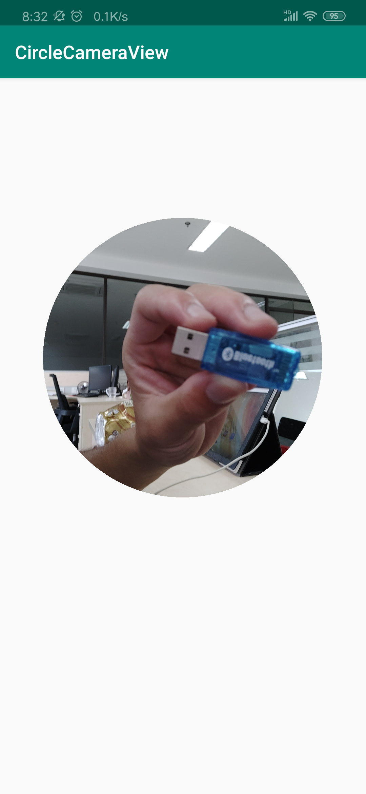

# 相机圆形窗口预览

***言不如一图...***


如果老铁还可以，不用请我和阔乐，不入就给我的个小星星 O_O

[源码地址 . GitHub](https://github.com/Trisia/CircleCameraPreview)


## Quick Start
引入依赖
```
implementation 'com.github.cliven.circlecamerapreview:circlecamerapreview:1.0.1'
```

> 引用依赖`Gralde 4.0 `以前版本
> ```
> compile 'com.github.cliven.circlecamerapreview:circlecamerapreview:1.0.1'
> ```


在xml中引用组件
```xml
<com.hznu.demo.app.circlecameraview.CircleCameraPreview
    android:layout_width="400dp"
    android:layout_height="400dp"
    android:background="@android:color/transparent" />
```
> 注意：
>
> - `width` 和 `height` 比例必须尽可能为 1:1，在真正绘制时可能会动态调整 `width` 和 `height`
> - `background` 必须设置，某则无法显示圆形，建议设置为透明`@android:color/transparent`


---

`AndroidManifest.xml` 加入相机使用权限
```xml
<uses-permission android:name="android.permission.CAMERA" />
```
确保程序在调用时能够授权
```
private static final String[] NEEDED_PERMISSION = {Manifest.permission.CAMERA};

if (ContextCompat.checkSelfPermission(this.getApplicationContext(), NEEDED_PERMISSION[0])
        != PackageManager.PERMISSION_GRANTED) {
    // 没有相机权限则停止运行
    ActivityCompat.requestPermissions(this, NEEDED_PERMISSION, REQ_CODE);
    return;
}
```

## 原理
> **请结合 [CircleCameraPreview 源码](https://github.com/Trisia/CircleCameraPreview/blob/master/circlecamerapreview/src/main/java/com/github/cliven/circlecamerapreview/CircleCameraPreview.java)  阅读下面内容**

1. 在xml中引用组件设置 宽高比为 1:1，背景为透明。
2. 找到相机支持最大的 4:3比例（该比例应该与）的照片尺寸，设置相机参数。
3. 根据相机和屏幕角度，动态调整view的`width` 和 `height`以适应图片比例，防止预览图片失真。
4. 重写SurfaceView的`onMeasure`，计算出圆形的半径和真正的宽高像素。
```java
protected void onMeasure(int widthMeasureSpec, int heightMeasureSpec) {
    super.onMeasure(widthMeasureSpec, heightMeasureSpec);
    // 坐标转换为实际像素
    int widthSize = MeasureSpec.getSize(widthMeasureSpec);
    int heightSize = MeasureSpec.getSize(heightMeasureSpec);
    // 计算出圆形的中心点, 右移动1位等价于除2
    centerPoint = new Point(widthSize >> 1, heightSize >> 1);
    // 计算出最短的边的一半作为半径
    radius = (widthSize >> 1 > heightSize >> 1) ? heightSize >> 1 : widthSize >> 1;
    setMeasuredDimension(widthSize, heightSize);
}
```
5. 重写SurfaceView的`draw`方法，在绘制之前，首先创建圆形路径并进行裁剪。
```java
public void draw(Canvas canvas) {
    if (clipPath == null) {
        clipPath = new Path();
        //设置裁剪的圆心，半径
        clipPath.addCircle(centerPoint.x, centerPoint.y, radius, Path.Direction.CCW);
    }
    //裁剪画布，并设置其填充方式
    canvas.clipPath(clipPath, Region.Op.REPLACE);
    super.draw(canvas);
}
```


> 如果解决了你的问题不如给我点个赞吧。

## 致谢

[1]. [CSDN . minyou_1314 . https://blog.csdn.net/minyou_1314/article/details/50971866](https://blog.csdn.net/minyou_1314/article/details/50971866)